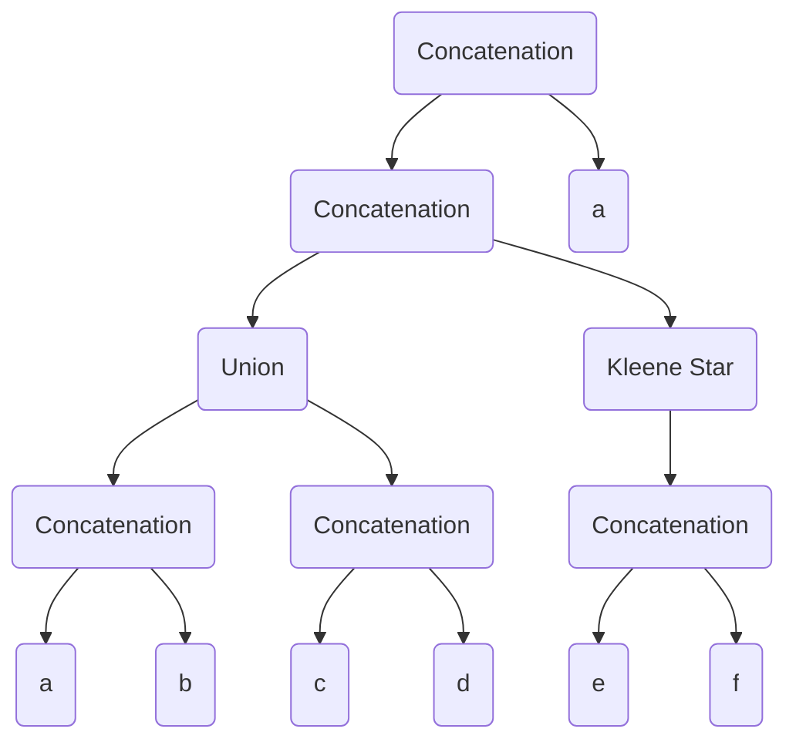

# Finite-State-Automatons-Tool
A implementacion of the basic functionalities of finite state automatons
# RegEx
A Polymorphic Hierarchy implemented with a tree for easy usage of regular expressions

### Usage
The main functionalities of regExHandler
Function | Description 
--- | --- 
buildFromString() | Algorithm for parsing string to regEx tree 
getString() | returns a string that represents the regular expression
getAutomata() | return a FiniteStateAutomaton with the same language as the regular expression

### Example
For a regular expression (ab+cd)(e+f)*a the tree would look like this

