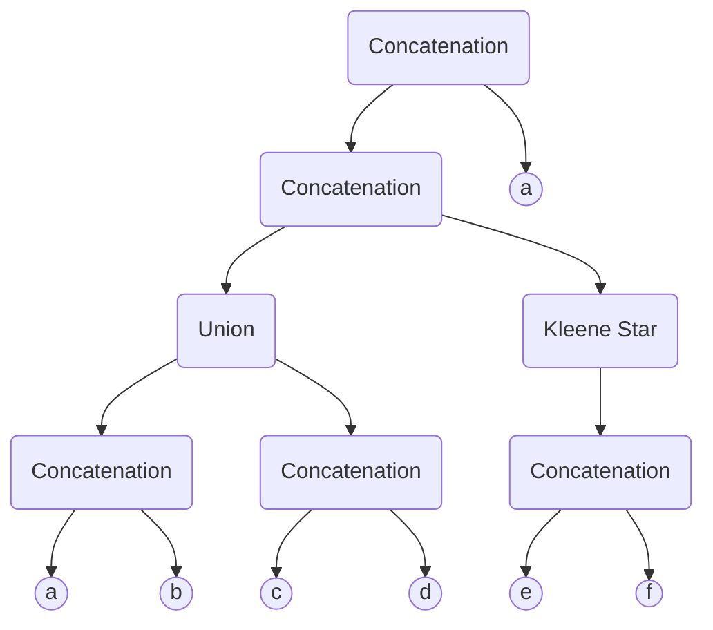
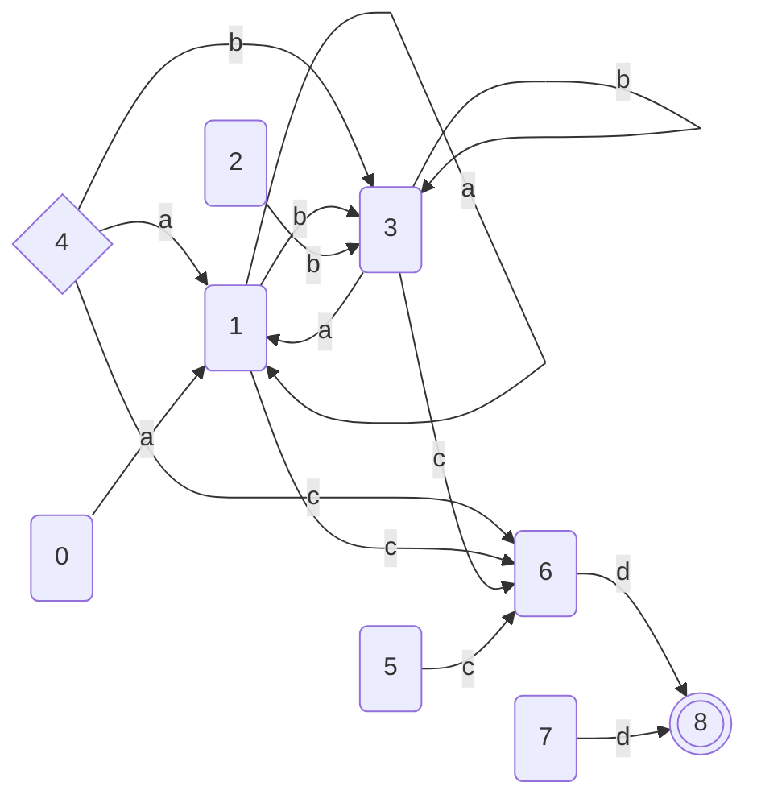
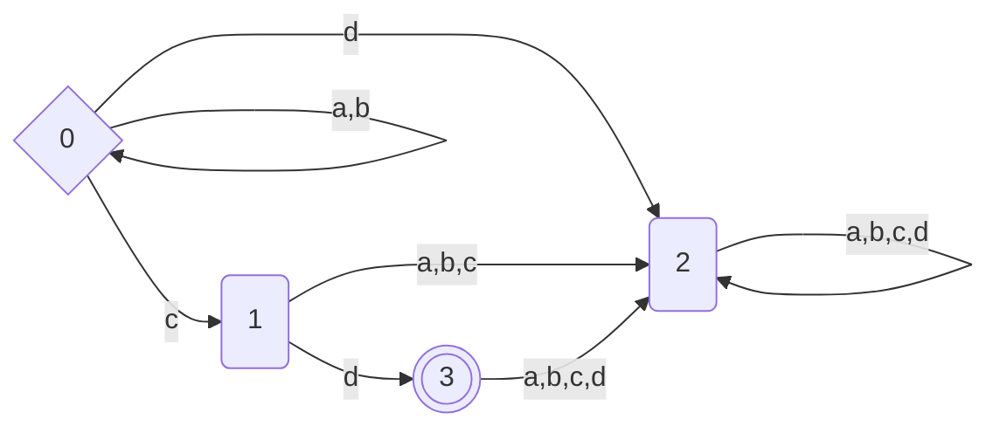

# Finite-State-Automatons-Tool
A implementacion of the basic functionalities of finite state automatons.
# RegEx
A Polymorphic Hierarchy implemented with a tree for easy usage of regular expressions.

### Usage
The main functionalities of regExHandler.
Return type | Function | Description 
--- | --- | --- 
RegEx* | buildFromString() | Algorithm for parsing string to regEx tree 
MyString | getString() | Returns a string that represents the regular expression
FiniteAutomata | getAutomata() | Return a FiniteAutomata with the same language as the regular expression

### Example
For a regular expression "(ab+cd)(e+f)*a" the tree would look like this.

# FiniteAutomata
An implementation of finite automata
A = <Q,Σ,s,δ,F>.
### Properties
Type | Property | Description 
--- | --- | --- 
int | nodes | Number of states in the automaton-(Q)
int | startNode | The start state of the automaton-(s)
Collection<char> | alphabet | A colection that represents the alphabet-(Σ)
Collection<Collection\<Transition\>> | automata | A graph that represents the transitions in the automaton-(δ)
BitSet | finalStates | A bit set that represents the final states of the automaton-(F)
bool | mulptipleStarts | Identifies if the automaton have multiple start states-(Used in minimization)
CustomCollection<int> | startStates | A colection of all the start states-(Used in minimization)
  
### Functions
Return type | Function | Description 
--- | --- | --- 
bool | accept(MyString word) | Return true if the word is in the language of the automaton
void | print() | Prints info for the automaton on in the console
void | addState() | Addint new state
void | changeStart(int index) | Changes the start state
void | addTransition(int index, Transition t) | Adding transition to state at position index
void | makeFinal(int index) | Make the state at position index final
void | makeDeterministic() | Makes the automaton deterministic
void | makeTotal() | Makes the automaton total
void | reverse() | Reverses the automaton
void | minimize() | Minimizes the automaton
bool | isEmptyLanguage() | Returns true if the language of the automaton is the empty set
RegExHandler | getRegEx() | Returns a regEx with the same language as the automaton
FiniteAutomata | Union(FiniteAutomata lhs,FiniteAutomata rhs) | Returns an automaton that is the union of lhs and rhs
FiniteAutomata | Concatenation(FiniteAutomata lhs,FiniteAutomata rhs) | Returns an automaton that is the concatenation of lhs and rhs
FiniteAutomata | KleeneStar(FiniteAutomata lhs) | Returns an automaton that is the KleeneStar of lhs
FiniteAutomata | Complement(FiniteAutomata lhs) | Returns an automaton that is the complement of lhs
FiniteAutomata | Intersection(FiniteAutomata lhs,FiniteAutomata rhs) | Returns an automaton that is the intersection of lhs and rhs
FiniteAutomata | Difference(FiniteAutomata lhs,FiniteAutomata rhs) | Returns an automaton that is the difference of lhs and rhs
  
 ### Example
For regular expression "(a+b)*cd" the automaton whould look like this:

Start state is 4, and final state is 8. This automaton is build by using the union, concatenation and kleene star operations.<br />
After determization the automaton would look like this:
  ```mermaid
  flowchart LR
    0{0} -->|a| 1 
    0{0} -->|b| 2 
    0{0} -->|c| 3 
    0{0} -->|d| 4 
    1(1) -->|a| 1 
    1(1) -->|b| 2 
    1(1) -->|c| 3 
    1(1) -->|d| 4 
    2(2) -->|a| 1 
    2(2) -->|b| 2 
    2(2) -->|c| 3 
    2(2) -->|d| 4 
    3(3) -->|a,b,c| 4 
    3(3) -->|d| 5 
    4(4) -->|a,b,c,d| 4 
    5((( 5 ))) -->|a,b,c,d| 4 
```
Start state is 0, and final state is 5.<br />
After minimization the automaton would look like this:

Start state is 0, and end state is 3. The automaton is minimized by the Brzozowski theorem. <br />
The regEx that will be returned by getRegEx() would be "(c+((a+b)+$)((a+b))*c)d" which is equal to "(a+b)*cd". (The symbol '$' is considered epsilon)
